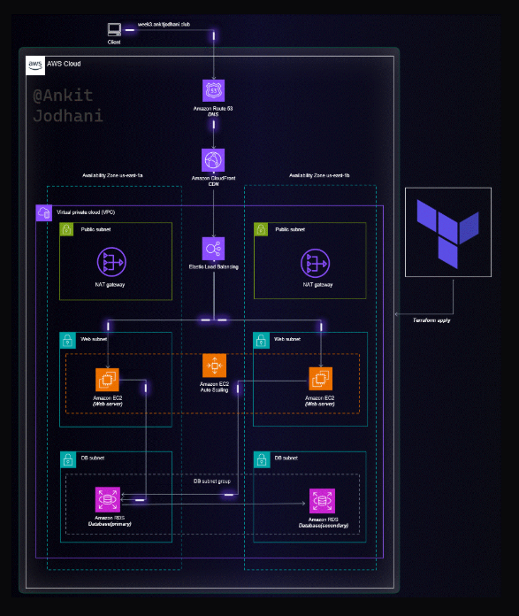

# AWS Infrastructure with Terraform

## Overview
This Terraform project sets up a 2 tier application architecture on AWS with NAT gateways in public subnets and ec2 servers in private subnets along with databases in private subnets

## Prerequisites
- [Terraform](https://developer.hashicorp.com/terraform/downloads)
- AWS CLI with configured credentials

## Setup
```sh
git clone https://github.com/Mmuaz-pixel/terraform-aws
cd Day2
terraform init
terraform apply -auto-approve
```

## Architecture 



## Resources
- **VPC** 
- **Public Subnets** 
- **Internet Gateways** for outbound internet access
- **Private subnets** for servers & database
- **EC2 Instances** in private subnets
- **Databases** in private subnets

## Cleanup
```sh
terraform destroy -auto-approve
```

## Notes
- Modify `terraform.tfvars` files in modules for customization.
